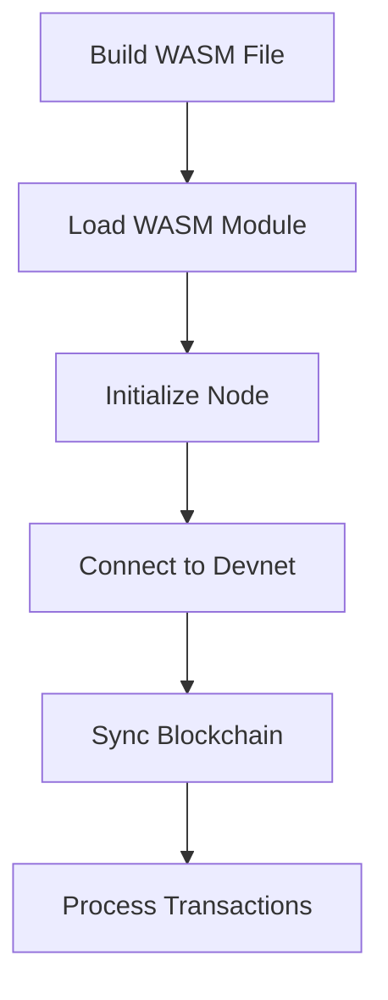
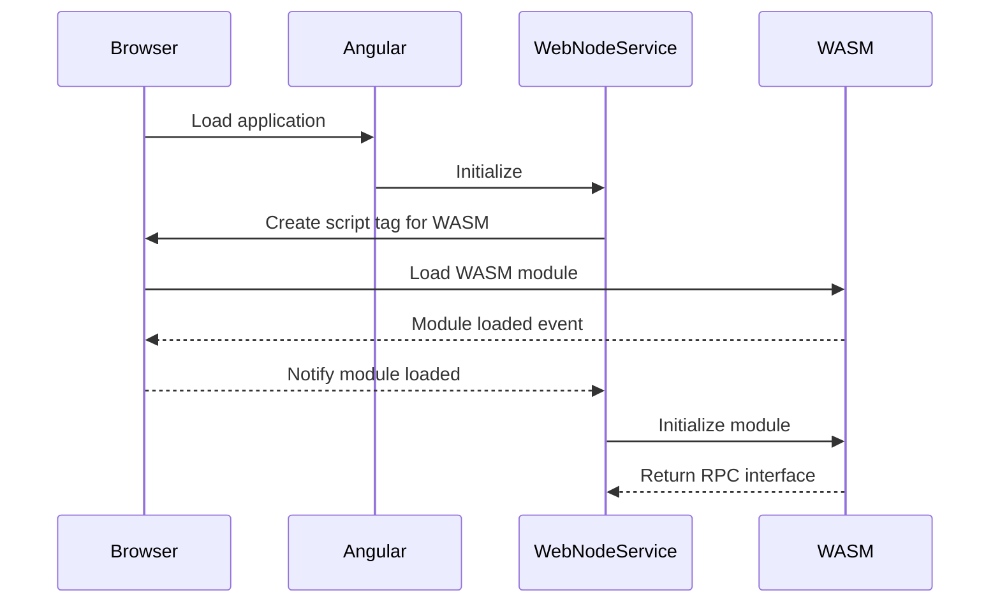
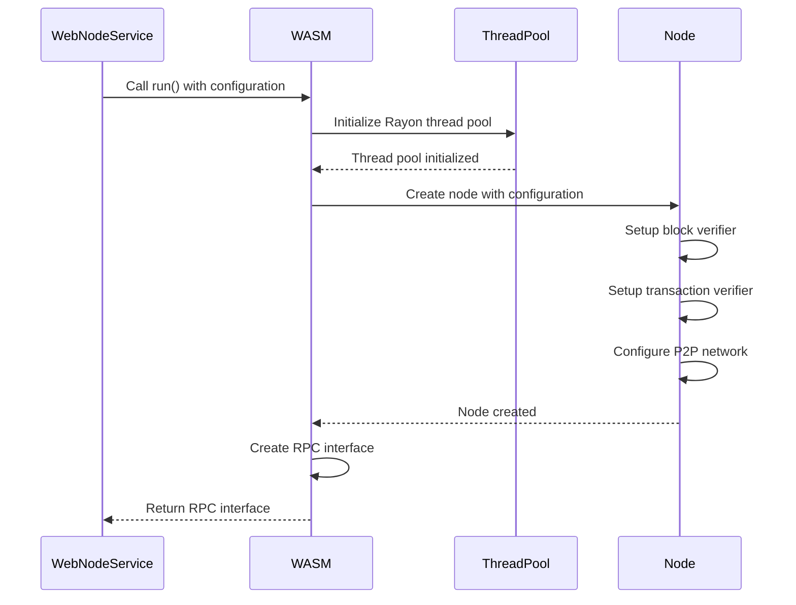
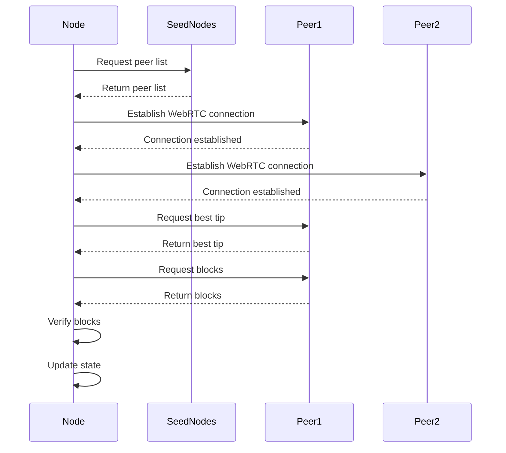

# OpenMina Web Node Lifecycle: Build, Load, Initialize, and Sync

This document provides a comprehensive guide to the OpenMina Web Node lifecycle, from building the WASM file to syncing with the devnet. It covers the technical details of each step in the process, including code examples and diagrams to help understand the flow.

## Table of Contents

1. [Overview](#overview)
2. [Building the WASM File](#building-the-wasm-file)
3. [Loading the WASM Module](#loading-the-wasm-module)
4. [Initializing the Node](#initializing-the-node)
5. [Syncing with Devnet](#syncing-with-devnet)
6. [Circuit Blobs and Supporting Files](#circuit-blobs-and-supporting-files)
7. [Troubleshooting](#troubleshooting)

## Overview

The OpenMina Web Node is a WebAssembly (WASM) implementation of the Mina Protocol node that runs directly in the browser. The lifecycle consists of several distinct phases:



## Building the WASM File

The OpenMina Web Node is built from Rust source code using the WebAssembly target. This section details the build process.

### Prerequisites

-   Rust (with nightly toolchain)
-   wasm-bindgen-cli
-   OpenMina repository

### Build Command

The WASM file is built using the following command:

```bash
cd node/web
cargo +nightly build --release --target wasm32-unknown-unknown
wasm-bindgen --keep-debug --web --out-dir ../../frontend/src/assets/webnode/pkg ../../target/wasm32-unknown-unknown/release/openmina_node_web.wasm
```

### Build Process Details

1. **Rust Compilation**: The first command compiles the Rust code to WebAssembly:

    ```bash
    cargo +nightly build --release --target wasm32-unknown-unknown
    ```

    This uses the nightly Rust compiler with the WebAssembly target to build the OpenMina node. The compilation process includes:

    - Compiling the Rust code to WASM
    - Optimizing the WASM binary for size and performance
    - Generating a single `.wasm` file at `../../target/wasm32-unknown-unknown/release/openmina_node_web.wasm`

2. **JavaScript Bindings Generation**: The second command generates JavaScript bindings for the WASM module:

    ```bash
    wasm-bindgen --keep-debug --web --out-dir ../../frontend/src/assets/webnode/pkg ../../target/wasm32-unknown-unknown/release/openmina_node_web.wasm
    ```

    This uses the `wasm-bindgen` tool to:

    - Generate JavaScript glue code to interact with the WASM module
    - Create TypeScript type definitions
    - Output the files to the specified directory

### Output Files

The build process generates the following files:

-   `openmina_node_web_bg.wasm`: The WebAssembly binary
-   `openmina_node_web.js`: JavaScript bindings for the WASM module
-   `openmina_node_web.d.ts`: TypeScript type definitions
-   `openmina_node_web_bg.wasm.d.ts`: TypeScript type definitions for the WASM binary

### Build Configuration

The build process uses specific configuration options to enable WebAssembly features required by the OpenMina node:

```toml
# .cargo/config.toml
[build]
target = "wasm32-unknown-unknown"

[target.wasm32-unknown-unknown]
rustflags = ["-C", "target-feature=+atomics,+bulk-memory,+mutable-globals", "-C", "link-arg=--max-memory=4294967296"]

[unstable]
build-std = ["panic_abort", "std"]
```

These options enable:

-   WebAssembly atomics for thread synchronization
-   Bulk memory operations for efficient memory manipulation
-   Mutable globals for state management
-   A maximum memory size of 4GB
-   Custom standard library compilation with panic abort behavior

## Loading the WASM Module

After building the WASM file, it needs to be loaded in the browser. This section explains how the WASM module is loaded and initialized.

### Directory Structure

Before loading the WASM module, ensure the following directory structure exists:

```
frontend/src/assets/webnode/
├── circuit-blobs/
│   └── 3.0.1devnet/
│       ├── block_verifier_index.postcard
│       ├── transaction_verifier_index.postcard
│       └── ... (other circuit blob files)
├── pkg/
│   ├── openmina_node_web_bg.wasm
│   ├── openmina_node_web.js
│   ├── openmina_node_web.d.ts
│   ├── openmina_node_web_bg.wasm.d.ts
│   └── snippets/
│       ├── p2p-d8c981af5e1bb8c5/
│       │   └── worker.js
│       └── wasm_thread-8ee53d0673203880/
│           └── worker.js
└── web-node-secrets.json
```

### Loading Process

The WASM module is loaded by the Angular application using a script tag in the HTML file. The loading process follows these steps:



### Code Implementation

The loading process is implemented in the `WebNodeService` class in the Angular application:

```typescript
// frontend/src/app/core/services/web-node.service.ts
loadWasm$(): Observable<void> {
  if (isBrowser()) {
    if (!any(window).webnode) {
      const script = document.createElement('script');
      script.src = 'assets/webnode/pkg/openmina_node_web.js';
      script.type = 'module';

      return new Observable<void>(observer => {
        script.onload = () => {
          any(window).webNodeLoaded = true;
          observer.next();
          observer.complete();
        };
        document.head.appendChild(script);
      }).pipe(
        switchMap(() => this.http.get<{ publicKey: string, privateKey: string }>('assets/webnode/web-node-secrets.json')),
        tap(data => {
          this.webNodeKeyPair = data.blockProducer;
          this.webNodeNetwork = data.network;
        }),
        map(() => void 0),
      );
    }
    return of(void 0);
  }
  return EMPTY;
}
```

This code:

1. Creates a script tag to load the WASM JavaScript bindings
2. Waits for the script to load
3. Loads the node configuration from `web-node-secrets.json`
4. Stores the configuration for later use

## Initializing the Node

Once the WASM module is loaded, the node needs to be initialized. This section explains the initialization process.

### Initialization Steps

The initialization process consists of several steps:

1. **WebAssembly Instantiation**: The WASM module is instantiated with the required memory configuration.
2. **Rayon Thread Pool Initialization**: The Rayon thread pool is initialized for parallel processing.
3. **Node Configuration**: The node is configured with the appropriate parameters.
4. **RPC Interface Creation**: An RPC interface is created for communication with the node.



### Code Implementation

The initialization process is implemented in the `startWasm$` method of the `WebNodeService` class:

```typescript
// frontend/src/app/core/services/web-node.service.ts
startWasm$(): Observable<any> {
  if (isBrowser()) {
    return of(any(window).webnode)
      .pipe(
        switchMap((wasm: any) => {
          this.wasm$.next(wasm);
          return from(wasm.default(undefined, new WebAssembly.Memory(this.memory)))
            .pipe(map(() => wasm));
        }),
        switchMap((wasm) => {
          this.webnodeProgress$.next('Loaded');
          const urls = {
            seeds: 'https://bootnodes.minaprotocol.com/networks/devnet-webrtc.txt',
          };

          let privateKey = this.privateStake ?
            [this.privateStake.stake, this.privateStake.password] :
            this.webNodeKeyPair.privateKey;

          if (this.noBlockProduction) {
            privateKey = null;
          }

          return from(wasm.run(privateKey, urls.seeds, urls.genesisConfig));
        }),
        tap((rpc) => {
          this.rpc$.next(rpc);
          this.webnodeProgress$.next('Running');
        }),
      );
  }
  return EMPTY;
}
```

This code:

1. Gets the WASM module from the window object
2. Initializes the module with the required memory configuration
3. Configures the node with the appropriate parameters:
    - Block producer key (if available)
    - Seed nodes URL
    - Genesis configuration URL
4. Calls the `run()` function to start the node
5. Stores the RPC interface for later use

### Rust Implementation

On the Rust side, the initialization process is implemented in the `run()` function:

```rust
// node/web/src/lib.rs
#[wasm_bindgen]
pub async fn run(
    block_producer: JsValue,
    seed_nodes_url: Option<String>,
    genesis_config_url: Option<String>,
) -> RpcSender {
    let block_producer = parse_bp_key(block_producer);

    let (rpc_sender_tx, rpc_sender_rx) = ::node::core::channels::oneshot::channel();
    let _ = thread::spawn(move || {
        wasm_bindgen_futures::spawn_local(async move {
            let mut node = setup_node(block_producer, seed_nodes_url, genesis_config_url).await;
            let _ = rpc_sender_tx.send(node.rpc());
            node.run_forever().await;
        });

        keep_worker_alive_cursed_hack();
    });

    rpc_sender_rx.await.unwrap()
}
```

The `setup_node()` function configures the node with the provided parameters:

```rust
// node/web/src/lib.rs
async fn setup_node(
    block_producer: Option<AccountSecretKey>,
    seed_nodes_url: Option<String>,
    genesis_config_url: Option<String>,
) -> openmina_node_common::Node<NodeService> {
    let block_verifier_index = BlockVerifier::make().await;
    let work_verifier_index = TransactionVerifier::make().await;

    let genesis_config = if let Some(genesis_config_url) = genesis_config_url {
        let bytes = ::node::core::http::get_bytes(&genesis_config_url)
            .await
            .expect("failed to fetch genesis config");
        GenesisConfig::Prebuilt(bytes.into()).into()
    } else {
        ::node::config::DEVNET_CONFIG.clone()
    };

    let mut node_builder: NodeBuilder = NodeBuilder::new(None, genesis_config);
    node_builder
        .block_verifier_index(block_verifier_index.clone())
        .work_verifier_index(work_verifier_index.clone());

    if let Some(seed_nodes_url) = seed_nodes_url {
        let peers = ::node::core::http::get_bytes(&seed_nodes_url)
            .await
            .expect("failed to fetch seed nodes");
        node_builder.initial_peers(
            String::from_utf8_lossy(&peers)
                .split("\n")
                .filter(|s| !s.trim().is_empty())
                .map(|s| s.trim().parse().expect("failed to parse seed node addr")),
        );
    }

    if let Some(bp_key) = block_producer {
        thread::spawn(move || {
            BlockProver::make(Some(block_verifier_index), Some(work_verifier_index));
        });
        node_builder.block_producer(bp_key, None);
    }

    node_builder
        .p2p_custom_task_spawner(P2pTaskRemoteSpawner {})
        .unwrap();
    node_builder.gather_stats();
    node_builder.build().context("node build failed!").unwrap()
}
```

This function:

1. Creates the block and transaction verifier indices
2. Configures the genesis state
3. Sets up the initial peers from the seed nodes URL
4. Configures the block producer (if available)
5. Builds and returns the node

### Thread Management

The OpenMina Web Node uses a special thread management system to handle WebAssembly threads. The `keep_worker_alive_cursed_hack()` function is used to keep worker threads alive:

```rust
// node/web/src/lib.rs
fn keep_worker_alive_cursed_hack() {
    wasm_bindgen::throw_str("Cursed hack to keep workers alive. See https://github.com/rustwasm/wasm-bindgen/issues/2945");
}
```

This function intentionally throws an error to prevent the worker thread from terminating. The error is caught and handled by the JavaScript code, allowing the thread to continue running.

## Syncing with Devnet

After initialization, the node connects to the devnet and begins syncing the blockchain. This section explains the synchronization process.

### Synchronization Steps

The synchronization process consists of several steps:

1. **Peer Discovery**: The node discovers peers using the seed nodes.
2. **Connection Establishment**: The node establishes WebRTC connections with peers.
3. **Best Tip Request**: The node requests the best tip from peers.
4. **Block Download**: The node downloads blocks from peers.
5. **Block Verification**: The node verifies the downloaded blocks.
6. **State Update**: The node updates its state based on the verified blocks.



### P2P Network Implementation

The P2P network is implemented using WebRTC for peer-to-peer communication. The node uses the following components:

1. **WebRTC Signaling**: The node uses a signaling server to establish WebRTC connections.
2. **Peer Discovery**: The node discovers peers using the seed nodes.
3. **Connection Management**: The node manages connections with peers.
4. **Message Handling**: The node handles messages from peers.

```rust
// node/web/src/node/p2p_task_spawner.rs
pub struct P2pTaskRemoteSpawner {}

impl TaskSpawner for P2pTaskRemoteSpawner {
    fn spawn(&self, name: &str, f: Box<dyn FnOnce() + Send>) -> Result<(), SpawnError> {
        let name = name.to_owned();
        let _ = thread::spawn(move || {
            wasm_bindgen_futures::spawn_local(async move {
                f();
            });
            keep_worker_alive_cursed_hack();
        });
        Ok(())
    }
}
```

This code spawns a new thread for each P2P task and uses the `keep_worker_alive_cursed_hack()` function to keep the thread alive.

### Block Synchronization

The block synchronization process is implemented in the `run_forever()` method of the `Node` class:

```rust
// node/web/src/node/mod.rs
pub async fn run_forever(&mut self) {
    loop {
        self.service.process_events(&mut self.state);
        self.service.process_effects(&mut self.state);
        self.service.process_actions(&mut self.state);

        // Sleep to avoid busy-waiting
        gloo_timers::future::sleep(Duration::from_millis(10)).await;
    }
}
```

This method continuously processes events, effects, and actions, which include:

1. **Events**: Network events, such as incoming connections and messages.
2. **Effects**: Side effects of state changes, such as sending messages to peers.
3. **Actions**: State transitions, such as applying blocks to the state.

### State Management

The node uses a Redux-like state management system to handle state transitions:

```rust
// node/src/state.rs
pub struct State {
    pub p2p: P2pState,
    pub transition_frontier: TransitionFrontierState,
    pub block_producer: BlockProducerState,
    pub snarker: SnarkerState,
    pub archive: ArchiveState,
    pub stats: StatsState,
}
```

This state is updated based on actions dispatched by the node:

```rust
// node/src/reducer.rs
pub fn reducer(state: &mut State, action: Action, time: Timestamp) {
    match action {
        Action::P2p(action) => p2p::reducer(state, action, time),
        Action::TransitionFrontier(action) => transition_frontier::reducer(state, action, time),
        Action::BlockProducer(action) => block_producer::reducer(state, action, time),
        Action::Snarker(action) => snarker::reducer(state, action, time),
        Action::Archive(action) => archive::reducer(state, action, time),
        Action::Stats(action) => stats::reducer(state, action, time),
    }
}
```

### Monitoring Synchronization Progress

The synchronization progress can be monitored using the RPC interface:

```typescript
// frontend/src/app/features/web-node/web-node.component.ts
ngOnInit(): void {
  this.webNodeService.rpc$
    .pipe(
      filter(Boolean),
      switchMap(rpc => {
        return interval(1000).pipe(
          switchMap(() => from(rpc.get_status())),
          tap(status => {
            this.status = status;
            this.syncProgress = this.calculateSyncProgress(status);
          })
        );
      }),
      takeUntil(this.destroy$)
    )
    .subscribe();
}

calculateSyncProgress(status: any): number {
  if (!status || !status.transition_frontier) {
    return 0;
  }

  const bestTip = status.transition_frontier.best_tip;
  if (!bestTip) {
    return 0;
  }

  const currentHeight = bestTip.blockchain_length;
  const maxHeight = status.transition_frontier.max_observed_height || currentHeight;

  return Math.min(100, (currentHeight / maxHeight) * 100);
}
```

This code:

1. Gets the node status every second
2. Calculates the synchronization progress based on the current block height and the maximum observed height
3. Updates the UI with the progress

## Circuit Blobs and Supporting Files

The OpenMina Web Node requires additional supporting files to function correctly. This section explains these files and how they are used.

### Circuit Blobs

Circuit blobs are binary files that contain the zero-knowledge proof verification keys and other cryptographic parameters required by the node. These files are used to verify blocks and transactions.

#### Required Circuit Blob Files

The following circuit blob files are required:

-   `block_verifier_index.postcard`: The block verifier index used to verify blocks.
-   `transaction_verifier_index.postcard`: The transaction verifier index used to verify transactions.
-   Various proving key files for blockchain and transaction snarks.

#### Directory Structure

The circuit blob files should be placed in the following directory:

```
frontend/src/assets/webnode/circuit-blobs/3.0.1devnet/
```

#### Downloading Circuit Blobs

The circuit blob files can be downloaded from the OpenMina GitHub repository:

```bash
#!/bin/bash

# Set the base URL for OpenMina
OPENMINA_BASE_URL="https://github.com/openmina"

# Function to download circuit files
download_circuit_files() {
    CIRCUITS_BASE_URL="$OPENMINA_BASE_URL/circuit-blobs/releases/download"
    CIRCUITS_VERSION="3.0.1devnet"

    DEVNET_CIRCUIT_FILES=(
        "block_verifier_index.postcard"
        "transaction_verifier_index.postcard"
        "step-step-proving-key-blockchain-snark-step-0-55f640777b6486a6fd3fdbc3fcffcc60_gates.json"
        "step-step-proving-key-blockchain-snark-step-0-55f640777b6486a6fd3fdbc3fcffcc60_internal_vars.bin"
        "step-step-proving-key-blockchain-snark-step-0-55f640777b6486a6fd3fdbc3fcffcc60_rows_rev.bin"
        "step-step-proving-key-transaction-snark-merge-1-ba1d52dfdc2dd4d2e61f6c66ff2a5b2f_gates.json"
        "step-step-proving-key-transaction-snark-merge-1-ba1d52dfdc2dd4d2e61f6c66ff2a5b2f_internal_vars.bin"
        "step-step-proving-key-transaction-snark-merge-1-ba1d52dfdc2dd4d2e61f6c66ff2a5b2f_rows_rev.bin"
        "wrap-wrap-proving-key-blockchain-snark-bbecaf158ca543ec8ac9e7144400e669_gates.json"
        "wrap-wrap-proving-key-blockchain-snark-bbecaf158ca543ec8ac9e7144400e669_internal_vars.bin"
        "wrap-wrap-proving-key-blockchain-snark-bbecaf158ca543ec8ac9e7144400e669_rows_rev.bin"
        "wrap-wrap-proving-key-transaction-snark-b9a01295c8cc9bda6d12142a581cd305_gates.json"
        "wrap-wrap-proving-key-transaction-snark-b9a01295c8cc9bda6d12142a581cd305_internal_vars.bin"
        "wrap-wrap-proving-key-transaction-snark-b9a01295c8cc9bda6d12142a581cd305_rows_rev.bin"
    )
    DOWNLOAD_DIR="frontend/src/assets/webnode/circuit-blobs/$CIRCUITS_VERSION"

    mkdir -p "$DOWNLOAD_DIR"

    for FILE in "${DEVNET_CIRCUIT_FILES[@]}"; do
        if [[ -f "$DOWNLOAD_DIR/$FILE" ]]; then
            echo "$FILE already exists in $DOWNLOAD_DIR, skipping download."
        else
            echo "Downloading $FILE to $DOWNLOAD_DIR..."
            curl -s -L --retry 3 --retry-delay 5 -o "$DOWNLOAD_DIR/$FILE" "$CIRCUITS_BASE_URL/$CIRCUITS_VERSION/$FILE"
            if [[ $? -ne 0 ]]; then
                echo "Failed to download $FILE after 3 attempts, exiting."
                exit 1
            else
                echo "$FILE downloaded successfully to $DOWNLOAD_DIR"
            fi
        fi
    done
}

# Call the function to download circuit files
download_circuit_files
```

### Worker Snippets

Worker snippets are JavaScript files that are used by the WebAssembly module to create and manage worker threads. These files are required for the node to function correctly.

#### Required Worker Snippet Files

The following worker snippet files are required:

-   `wasm_thread-8ee53d0673203880/worker.js`: The worker thread implementation for the WASM module.
-   `p2p-d8c981af5e1bb8c5/worker.js`: The worker thread implementation for the P2P network.

#### Directory Structure

The worker snippet files should be placed in the following directory:

```
frontend/src/assets/webnode/snippets/
```

#### Worker Snippet Implementation

The worker snippet files contain the code that runs in the worker threads:

```javascript
// frontend/src/assets/webnode/snippets/wasm_thread-8ee53d0673203880/worker.js
self.onmessage = (e) => {
    const { id, module, memory, fn, args } = e.data
    try {
        const result = module.exports[fn](...args)
        self.postMessage({ id, result })
    } catch (error) {
        self.postMessage({ id, error: error.toString() })
    }
}
```

This code:

1. Receives a message from the main thread with the function to execute and its arguments
2. Executes the function with the provided arguments
3. Returns the result or error to the main thread

### Configuration Files

The OpenMina Web Node requires a configuration file to specify the node parameters.

#### web-node-secrets.json

The `web-node-secrets.json` file contains the configuration for the web node:

```json
{
    "blockProducerKey": null,
    "seedNodesUrl": "https://bootnodes.minaprotocol.com/networks/devnet-webrtc.txt"
}
```

This file specifies:

-   `blockProducerKey`: The private key for block production (null for non-block-producing nodes)
-   `seedNodesUrl`: The URL to fetch the seed nodes from

#### Directory Structure

The configuration file should be placed in the following directory:

```
frontend/src/assets/webnode/
```

## Troubleshooting

This section provides solutions to common issues that may arise when building, loading, or running the OpenMina Web Node.

### Common Issues

#### 1. "Cursed hack to keep workers alive" Error

**Issue**: The following error appears in the browser console:

```
Uncaught (in promise) Error: Cursed hack to keep workers alive. See https://github.com/rustwasm/wasm-bindgen/issues/2945
```

**Solution**: This is not an actual error but a deliberate hack used to keep worker threads alive. It can be safely ignored. The error is thrown by the `keep_worker_alive_cursed_hack()` function in the Rust code:

```rust
fn keep_worker_alive_cursed_hack() {
    wasm_bindgen::throw_str("Cursed hack to keep workers alive. See https://github.com/rustwasm/wasm-bindgen/issues/2945");
}
```

This is a workaround for a known issue in wasm-bindgen where worker threads might terminate prematurely if there's no active JavaScript code keeping them alive.

#### 2. Missing Circuit Blob Files

**Issue**: The following error appears in the browser console:

```
Failed to fetch circuit blob: block_verifier_index.postcard
```

**Solution**: Ensure that all required circuit blob files are downloaded and placed in the correct directory:

```
frontend/src/assets/webnode/circuit-blobs/3.0.1devnet/
```

You can use the script provided in the [Circuit Blobs](#circuit-blobs) section to download the required files.

#### 3. Missing Worker Snippet Files

**Issue**: The following error appears in the browser console:

```
Failed to load worker snippet: wasm_thread-8ee53d0673203880/worker.js
```

**Solution**: Ensure that all required worker snippet files are created and placed in the correct directory:

```
frontend/src/assets/webnode/snippets/
```

You can create the required files as described in the [Worker Snippets](#worker-snippets) section.

#### 4. Missing web-node-secrets.json File

**Issue**: The following error appears in the browser console:

```
Http failure response for http://localhost:63001/assets/webnode/web-node-secrets.json: 404 Not Found
```

**Solution**: Create the `web-node-secrets.json` file and place it in the correct directory:

```
frontend/src/assets/webnode/web-node-secrets.json
```

The file should contain the following content:

```json
{
    "blockProducerKey": null,
    "seedNodesUrl": "https://bootnodes.minaprotocol.com/networks/devnet-webrtc.txt"
}
```

#### 5. WebAssembly Threads Not Supported

**Issue**: The following error appears in the browser console:

```
WebAssembly threads are not supported in this browser
```

**Solution**: Ensure that you are using a browser that supports WebAssembly threads, such as Chrome or Firefox. Also, make sure that the browser is configured to allow cross-origin isolation, which is required for WebAssembly threads.

To enable cross-origin isolation, the server must send the following headers:

```
Cross-Origin-Opener-Policy: same-origin
Cross-Origin-Embedder-Policy: require-corp
```

#### 6. Failed to Connect to Peers

**Issue**: The node fails to connect to any peers, and the following error appears in the browser console:

```
Failed to connect to peer: <peer-id>
```

**Solution**: Ensure that the seed nodes URL is correct and accessible. The default URL is:

```
https://bootnodes.minaprotocol.com/networks/devnet-webrtc.txt
```

Also, make sure that your browser allows WebRTC connections, which are used for peer-to-peer communication.

### Debugging Tips

#### 1. Enable Verbose Logging

To enable verbose logging, add the following code to the `WebNodeService` class:

```typescript
// frontend/src/app/core/services/web-node.service.ts
constructor() {
  // ...
  console.log = (...args) => {
    const timestamp = new Date().toISOString();
    console.info(`[${timestamp}]`, ...args);
  };
}
```

This will add timestamps to all console logs, making it easier to track the sequence of events.

#### 2. Monitor Node Status

You can monitor the node status by periodically calling the `get_status()` method on the RPC interface:

```typescript
// frontend/src/app/features/web-node/web-node.component.ts
ngOnInit(): void {
  this.webNodeService.rpc$
    .pipe(
      filter(Boolean),
      switchMap(rpc => {
        return interval(1000).pipe(
          switchMap(() => from(rpc.get_status())),
          tap(status => {
            console.log('Node status:', status);
          })
        );
      }),
      takeUntil(this.destroy$)
    )
    .subscribe();
}
```

This will log the node status every second, allowing you to track the synchronization progress and other metrics.

#### 3. Inspect Network Traffic

You can use the browser's developer tools to inspect the network traffic between the node and its peers. This can help identify issues with peer discovery and connection establishment.

To open the developer tools in Chrome, press F12 or right-click on the page and select "Inspect". Then, go to the "Network" tab and filter for WebSocket connections.

#### 4. Check for Cross-Origin Isolation

To check if cross-origin isolation is enabled, open the browser's developer tools and run the following command in the console:

```javascript
console.log("Cross-Origin Isolation:", window.crossOriginIsolated)
```

If cross-origin isolation is enabled, this will output `true`. If not, it will output `false`, and WebAssembly threads may not work correctly.

### Performance Optimization

#### 1. Increase Memory Limit

If the node runs out of memory, you can increase the memory limit by modifying the memory configuration in the `WebNodeService` class:

```typescript
// frontend/src/app/core/services/web-node.service.ts
private memory = {
  initial: 32, // 32 pages (2MB)
  maximum: 65536, // 65536 pages (4GB)
  shared: true
};
```

#### 2. Reduce Polling Interval

If the node is consuming too much CPU, you can reduce the polling interval in the `run_forever()` method:

```rust
// node/web/src/node/mod.rs
pub async fn run_forever(&mut self) {
    loop {
        self.service.process_events(&mut self.state);
        self.service.process_effects(&mut self.state);
        self.service.process_actions(&mut self.state);

        // Sleep to avoid busy-waiting
        gloo_timers::future::sleep(Duration::from_millis(50)).await; // Increased from 10ms to 50ms
    }
}
```

This will reduce the frequency of state updates, which can help reduce CPU usage.
